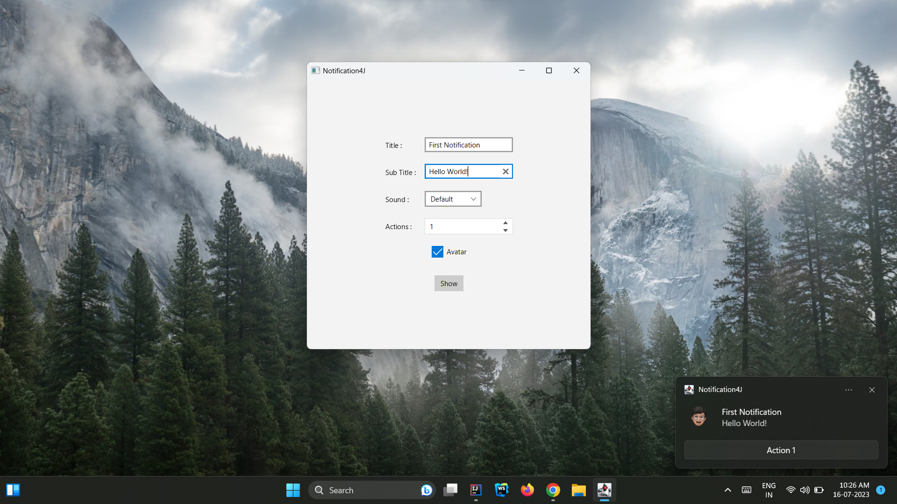

# Notification4J Quick Start



## Example

- Clone this repository by running the following command in your terminal: 
  ```
  git clone https://github.com/PreetJagani/Notification4J-QuickStart.git
  ```

- Open the cloned project in your preferred IDE, such as IntelliJ IDEA.

- Run the `Launcher.java` file to execute the example application.